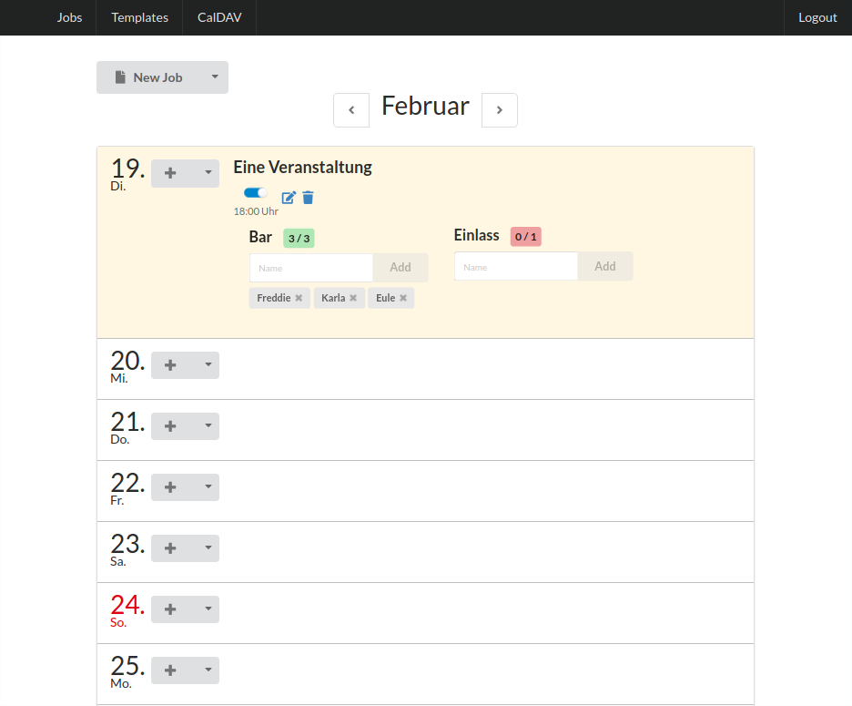

# Jobbar - jobs scheduling platform for NonProfits

Lightweight and easy web-based platform solution to manage employees for events and jobs. Originally created for the great [UT Connewitz](http://utconnewitz.de/).

## Screenshots

Example screenshot of the jobs browser:

## Features

- calendar view of events, their jobs and subscribers
- manage events and jobs
- add/remove subscribers
- get imminent free jobs alerts
- import events from caldav calendar

## Install

TODO (downlaod release, ...)

### Requirements

(see laravel requirements)

- nginx/apache with mod_rewrite
- PHP > 7.1
- SSH access recommended

## Development

Basically its based on a [Laravel](http://laravel.com/) REST API backend and a [ReactJS](http://reactjs.org/) frontend.

To setup a (Docker based) development environmant and start coding see https://github.com/ut-connewitz/jobbar-dev-env .

## License

The Jobbar is open-sourced software licensed under the [MIT license](https://opensource.org/licenses/MIT).
